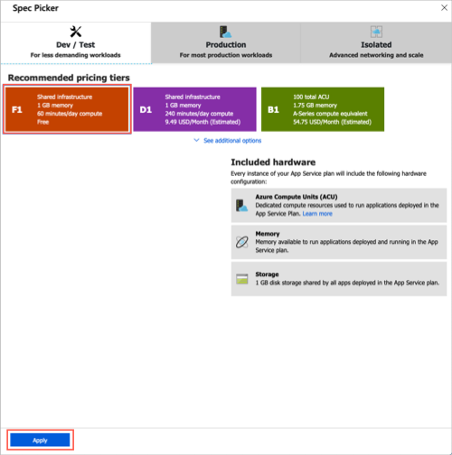

Als Technologieexperte verfügen Sie wahrscheinlich über Expertenwissen in einem bestimmten Bereich. Vielleichtsind Sie ein Experte für Speicheradministratoren oder Virtualisierung oder konzentrieren sich vielleicht auf die neuesten Sicherheitsmethoden. Wenn Sie ein Student sind, werden Sie möglicherweise immer noch erforschen, was Sie am meisten interessiert.

Ganz gleich, welche Rolle Sie spielen, die meisten Menschen beginnen mit der Cloud, indem Sie eine Website erstellen. Hier stellen Sie eine Website bereit, die in einem App-Dienst gehostet wird.

Sehen wir uns einige grundlegende Ausdrücke an, um die erste Website in Betrieb zu nehmen.

## Was ist ein App-Dienst?

Der Azure-App-Dienst ist ein HTTP-basierter Dienst, mit dem Sie viele Arten von webbasierten Lösungen erstellen und hosten können, ohne die Infrastruktur zu verwalten. So können Sie beispielsweise Web-Apps, Mobile Back Ends und RESTful-APIs in verschiedenen unterstützten Programmiersprachen hosten. Anwendungen, die in .net, .net Core, Java, Ruby, Node. js, PHP oder python entwickelt wurden, können sowohl auf Windows-als auch auf Linux-basierten Umgebungen problemlos ausgeführt und skaliert werden.

Wir sind bestrebt, eine Website in weniger als der Zeit zu erstellen, die Sie zum Mittagessen benötigt. Daher werden wir keinen Code schreiben und stattdessen eine vordefinierte Anwendung aus dem Microsoft Azure Marketplace bereitstellen.

## Was ist der Microsoft Azure Marketplace?

Bei Microsoft Azure Marketplace handelt es sich um einen Online Speicher, in dem Anwendungen gehostet werden, die zertifiziert und für die Ausführung in Azure optimiert sind. Es stehen viele Arten von Anwendungen zur Verfügung, die von AI + Machine Learning bis hin zu Webanwendungen reichen. Wie Sie in ein paar Minuten sehen werden, erfolgt die Bereitstellung aus dem Store über das Azure-Portal mithilfe einer Benutzeroberfläche im Assistenten Stil. Diese Benutzeroberfläche macht die Auswertung unterschiedlicher Lösungen einfach.

Wir werden eine der Optionen für die WordPress-Anwendung aus dem Azure Marketplace für unsere Website verwenden.

## Erstellen von Ressourcen in Azure

In der Regel müssen wir zunächst eine *Ressourcengruppe* erstellen, um alle Elemente zu speichern, die wir erstellen müssen. Mit der *Ressourcengruppe* können wir alle Dienste, Datenträger, Netzwerkschnittstellen und andere Elemente verwalten, die unsere Lösung potenziell als Einheit ausmachen. Wir können das Azure-Portal verwenden, um die Ressourcengruppen unserer Lösung zu erstellen und zu verwalten. Beachten Sie jedoch, dass Sie Ressourcen auch über eine Befehlszeile mithilfe der Azure-CLI verwalten können. Die Azure-CLI ist eine nützliche Option, wenn Sie den Prozess in Zukunft automatisieren müssen.

In der kostenlosen Azure Sandbox-Umgebung verwenden Sie die zuvor erstellte Ressourcengruppe **<rgn>[Sandbox-Ressourcengruppenname]</rgn>**, und Sie müssen diesen Schritt nicht ausführen.

Screenshot der test1-myamada-2-PNG-Dateien 

Test2 myamada-derselbe PNG 
